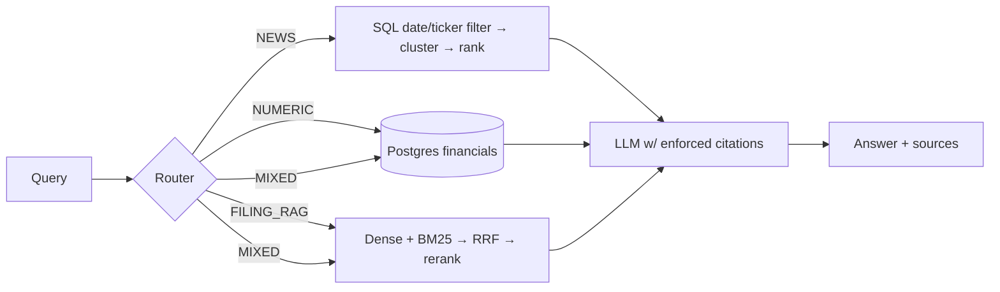

# Financial Research Copilot

Production-style RAG system over SEC filings, structured financials (XBRL → Postgres), and ticker news.
Hybrid retrieval (dense + BM25 + RRF), cross-encoder reranking, query routing, citation-enforced generation, and measured evals (dense vs hybrid vs hybrid+rerank).

**Status: Phase 2 (indexing) — embedding, Qdrant, and BM25 built; `src/chunking/chunker.py` is signatures-only and owner-implemented.** Build order and full spec: [CLAUDE.md](CLAUDE.md). Decisions log: [DECISIONS.md](DECISIONS.md).

## Quickstart
```bash
docker compose up -d
pip install -e .
python scripts/init_db.py
python scripts/smoke_test.py     # gate for Phase 1
python scripts/ingest_filings.py # Phase 1: pull filings for every ticker in config.yaml
python scripts/smoke_index.py    # gate for Phase 2: indexing path on synthetic chunks
python scripts/build_index.py    # Phase 2: parse -> chunk -> embed -> Qdrant + BM25
```

## Index layout
| Store | Holds | Key |
|---|---|---|
| `chunks` table (Postgres/SQLite) | chunk **text** (single source of truth), section, chunk_index, n_tokens | `chunk_id` |
| Qdrant `filings` | 384-d bge-small vectors + metadata payload (no text), HNSW m=16/ef_construct=100 | `uuid5(chunk_id)` |
| `data/bm25.pkl` | tokenized corpus + metadata (no text) | `chunk_id` |

`chunk_id` is the join key across all three; both retrievers return ids and hydrate text from SQL. See [DECISIONS.md](DECISIONS.md) #12–#16.

## Data sources and limitations
- **Filings**: SEC EDGAR (`data.sec.gov` submissions API + `www.sec.gov/Archives`), free, no key required. Fair-access rate limiting and a contact-email User-Agent are enforced per config.
- **Earnings call transcripts**: not sourced. Paid providers are out of scope, and free scrapes of licensed transcript sites (e.g. Motley Fool) aren't permitted. The substitute is the **8-K EX-99.1 earnings press release**, which SEC filers publish freely alongside the numbers — see [DECISIONS.md](DECISIONS.md) #10 for how that exhibit is located (EDGAR's own document-type metadata, not filename guessing).

## Architecture

