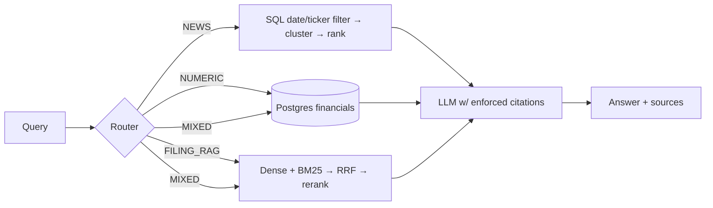

# Financial Research Copilot

Production-style RAG system over SEC filings, structured financials (XBRL → Postgres), and ticker news.
Hybrid retrieval (dense + BM25 + RRF), cross-encoder reranking, query routing, citation-enforced generation, and measured evals (dense vs hybrid vs hybrid+rerank).

**Status: Phase 3 (retrieval) complete — dense, BM25, RRF fusion and cross-encoder reranking behind one `Retriever`. Next: Phase 4 (structured financials).** Build order and full spec: [CLAUDE.md](CLAUDE.md). Decisions log: [DECISIONS.md](DECISIONS.md). Known failures: [evals/failure_cases.md](evals/failure_cases.md).

## Quickstart
```bash
docker compose up -d
pip install -e .
python scripts/init_db.py
python scripts/smoke_test.py     # gate for Phase 1
python scripts/ingest_filings.py # Phase 1: pull filings for every ticker in config.yaml
python scripts/smoke_index.py    # gate for Phase 2: indexing path on synthetic chunks
python scripts/build_index.py    # Phase 2: parse -> chunk -> embed -> Qdrant + BM25
python scripts/smoke_retrieval.py # gate for Phase 3: retrieval stack on the real corpus
```

## Index layout
| Store | Holds | Key |
|---|---|---|
| `chunks` table (Postgres/SQLite) | chunk **text** (single source of truth), section, chunk_index, n_tokens | `chunk_id` |
| Qdrant `filings` | 384-d bge-small vectors + metadata payload (no text), HNSW m=16/ef_construct=100 | `uuid5(chunk_id)` |
| `data/bm25.pkl` | tokenized corpus + metadata (no text) | `chunk_id` |

`chunk_id` is the join key across all three; both retrievers return ids and hydrate text from SQL. See [DECISIONS.md](DECISIONS.md) #12–#16.

Chunks target **480 tokens**, not the 600–900 CLAUDE.md suggests: bge-small truncates at 512 wordpieces *silently*, and at a 750-token target 28.3% of corpus tokens never reach the encoder while remaining fully visible to BM25 and to the text a citation renders. [DECISIONS.md](DECISIONS.md) #17 has the measurement; 480-vs-750 recall is a Phase 7 eval item.

## Retrieval
One `Retriever` (`src/retrieval/hybrid.py`), four modes, shared candidate pool and shared `Filters` — so the Phase 7 A/B compares retrievers rather than plumbing.

| mode | path | returns |
|---|---|---|
| `dense` | bge-small query vector → Qdrant HNSW | top-30 |
| `bm25` | tokenized query → BM25Okapi over the same chunks | top-30 |
| `hybrid` | RRF (k=60) over dense top-30 + BM25 top-30 | top-30 |
| `rerank` | the fused pool → `ms-marco-MiniLM-L-6-v2` cross-encoder | **top-6** (default) |

```python
from src.common.models import Filters
from src.retrieval.hybrid import Retriever

with Retriever() as r:
    hits = r.search("why did data center revenue grow",
                    mode="rerank", filters=Filters(tickers=["NVDA"], doc_types=["10-Q"]))
```

`Filters` (ticker / doc_type / section / date range) is pushed *into* both engines — a Qdrant payload filter on the dense side, a pre-top-k predicate on the sparse side — never applied to results ([DECISIONS.md](DECISIONS.md) #15). Every mode returns the same `RetrievedChunk` dataclass, which is what makes them swappable in eval.

## Data sources and limitations
- **Filings**: SEC EDGAR (`data.sec.gov` submissions API + `www.sec.gov/Archives`), free, no key required. Fair-access rate limiting and a contact-email User-Agent are enforced per config.
- **Earnings call transcripts**: not sourced. Paid providers are out of scope, and free scrapes of licensed transcript sites (e.g. Motley Fool) aren't permitted. The substitute is the **8-K EX-99.1 earnings press release**, which SEC filers publish freely alongside the numbers — see [DECISIONS.md](DECISIONS.md) #10 for how that exhibit is located (EDGAR's own document-type metadata, not filename guessing).

## Architecture

