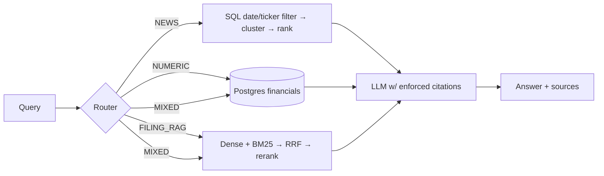

# Financial Research Copilot

Production-style RAG system over SEC filings, structured financials (XBRL → Postgres), and ticker news.
Hybrid retrieval (dense + BM25 + RRF), cross-encoder reranking, query routing, citation-enforced generation, and measured evals (dense vs hybrid vs hybrid+rerank).

**Status: Phase 5 (news pipeline) complete — RSS ingest, dedup, event clustering, ranked weekly brief. Next: Phase 6 (router + generation).** Build order and full spec: [CLAUDE.md](CLAUDE.md). Decisions log: [DECISIONS.md](DECISIONS.md). Known failures: [evals/failure_cases.md](evals/failure_cases.md).

## Quickstart
```bash
docker compose up -d
pip install -e .
python scripts/init_db.py
python scripts/smoke_test.py     # gate for Phase 1
python scripts/ingest_filings.py # Phase 1: pull filings for every ticker in config.yaml
python scripts/smoke_index.py    # gate for Phase 2: indexing path on synthetic chunks
python scripts/build_index.py    # Phase 2: parse -> chunk -> embed -> Qdrant + BM25
python scripts/smoke_retrieval.py # gate for Phase 3: retrieval stack on the real corpus
python scripts/load_financials.py # Phase 4: XBRL companyfacts -> financials + guidance
python scripts/smoke_financials.py # gate for Phase 4
python scripts/ingest_news.py     # Phase 5: RSS -> dedup -> event clusters
python scripts/smoke_news.py      # gate for Phase 5
python scripts/smoke_headline_only.py   # gate: no claims beyond the headlines (FC-6)
python scripts/news_brief.py --ticker NVDA   # weekly intelligence brief
```

## Index layout
| Store | Holds | Key |
|---|---|---|
| `chunks` table (Postgres/SQLite) | chunk **text** (single source of truth), section, chunk_index, n_tokens | `chunk_id` |
| Qdrant `filings` | 384-d bge-small vectors + metadata payload (no text), HNSW m=16/ef_construct=100 | `uuid5(chunk_id)` |
| `data/bm25.pkl` | tokenized corpus + metadata (no text) | `chunk_id` |

`chunk_id` is the join key across all three; both retrievers return ids and hydrate text from SQL. See [DECISIONS.md](DECISIONS.md) #12–#16.

Chunks target **480 tokens**, not the 600–900 CLAUDE.md suggests: bge-small truncates at 512 wordpieces *silently*, and at a 750-token target 28.3% of corpus tokens never reach the encoder while remaining fully visible to BM25 and to the text a citation renders. [DECISIONS.md](DECISIONS.md) #17 has the measurement; 480-vs-750 recall is a Phase 7 eval item.

## Retrieval
One `Retriever` (`src/retrieval/hybrid.py`), four modes, shared candidate pool and shared `Filters` — so the Phase 7 A/B compares retrievers rather than plumbing.

| mode | path | returns |
|---|---|---|
| `dense` | bge-small query vector → Qdrant HNSW | top-30 |
| `bm25` | tokenized query → BM25Okapi over the same chunks | top-30 |
| `hybrid` | RRF (k=60) over dense top-30 + BM25 top-30 | top-30 |
| `rerank` | the fused pool → `ms-marco-MiniLM-L-6-v2` cross-encoder | **top-6** (default) |

```python
from src.common.models import Filters
from src.retrieval.hybrid import Retriever

with Retriever() as r:
    hits = r.search("why did data center revenue grow",
                    mode="rerank", filters=Filters(tickers=["NVDA"], doc_types=["10-Q"]))
```

`Filters` (ticker / doc_type / section / date range) is pushed *into* both engines — a Qdrant payload filter on the dense side, a pre-top-k predicate on the sparse side — never applied to results ([DECISIONS.md](DECISIONS.md) #15). Every mode returns the same `RetrievedChunk` dataclass, which is what makes them swappable in eval.

## Structured financials
Numbers live in SQL, never in the vector store — vector search answers *why*, SQL answers *how much*. Source is the SEC companyfacts XBRL API (free, no key).

| metric | NVDA | MSFT | JPM |
|---|---|---|---|
| revenue | `Revenues` | `RevenueFromContractWithCustomerExcludingAssessedTax` | `RevenuesNetOfInterestExpense` |
| eps_diluted | ✓ | ✓ | ✓ |
| operating_income | ✓ | ✓ | — not reported |
| gross_margin | ✓ (derived) | ✓ (derived) | — not reported |

Three filers, three different revenue concepts and three different fiscal calendars (NVDA FY ends January, MSFT June, JPM December). The tag is chosen by measured coverage, not by chain order, and the fiscal period is computed from each fact's own end date — the API's `fy`/`fp` fields describe the *filing*, not the fact, and disagree with themselves across filings. Q4 is derived (`FY − 9M`) because filers don't report it, but never for EPS. See [DECISIONS.md](DECISIONS.md) #19 for all six traps.

The LLM never writes SQL. `src/structured/queries.py` exposes a registry of 8 canned parameterized queries the router picks by name:

```python
from src.structured import queries
queries.run(conn, "yoy_growth", ticker="NVDA", metric="revenue", n_quarters=4)
# FY2027Q2: $96.22B (YoY +105.9% vs FY2026Q2)
```

Growth is computed against the **named** prior period, so a hole in the series (Q4 EPS is never derived) returns "not comparable" instead of silently comparing Q1 to Q3 — [DECISIONS.md](DECISIONS.md) #20.

## News pipeline
Hard filters first: ticker and date are a SQL `WHERE`, never a similarity search. Clustering happens at ingest; the brief reads `event_id` as a column.

```
RSS (Google News + Yahoo + company IR)
  -> alias relevance filter        (Yahoo's ticker feed leaks generic finance content)
  -> exact-URL dedup
  -> headline-embedding dedup      (cosine >= 0.90, earliest copy wins;
                                    a resolvable URL beats an earlier Google redirect)
  -> agglomerative clustering      (cosine >= 0.75, average linkage) -> event_id
  -> rank by source diversity      (volume capped so it can only break ties)
  -> LLM summary w/ bull/bear      (extractive fallback when no backend is reachable)
```

Two findings shaped this and are worth reading before trusting the output:

**Headlines are dominated by the company name.** Every NVDA headline contains "Nvidia", `(NASDAQ:NVDA)` and a ` - Publisher` suffix, adding a *constant* ~0.13 to every pairwise cosine. At the configured 0.75 threshold that merged 39 unrelated articles into one "event". Stripping those three elements before embedding cut spurious above-threshold pairs from 690 to 51 — [DECISIONS.md](DECISIONS.md) #22. The stored headline stays verbatim; only the vectors are normalized.

**Article count is the wrong importance signal.** The biggest JPM cluster in a live window was 18 automated 13F posts from one publisher. Ranking is `n_sources + 0.25 * min(n_articles, 3)`, so n articles from one source can never outrank n+1 sources — [DECISIONS.md](DECISIONS.md) #23, [failure_cases.md](evals/failure_cases.md) FC-4.

## Data sources and limitations
- **Filings**: SEC EDGAR (`data.sec.gov` submissions API + `www.sec.gov/Archives`), free, no key required. Fair-access rate limiting and a contact-email User-Agent are enforced per config.
- **News**: feeds are ordered direct-first, with Google News as the coverage fallback. Company IR feeds (all three tickers) are authoritative and extract 16/17 of the time; Yahoo Finance RSS gives direct URLs trafilatura usually handles; Google News RSS has the broadest reach but its links are opaque redirects to a JS interstitial, so the real article URL is unrecoverable and those items are **headline-only** — it supplies 176 of 216 items and 0 of the bodies. Net: **37 of 209 non-duplicate articles carry body text (17.7%)**, up from 13.1% before the IR feeds were fixed. Validate feeds on the date of their newest item, not on HTTP 200 — MSFT's old feed returned a healthy, 16-month-stale feed. See [DECISIONS.md](DECISIONS.md) #21.
- **Guidance**: extracted from 8-K EX-99.1 outlook blocks by regex, not LLM. NVDA publishes numeric guidance; MSFT's outlook section defers to the earnings call and JPM issues none, so those are legitimately empty — see [evals/failure_cases.md](evals/failure_cases.md) FC-3.
- **Earnings call transcripts**: not sourced. Paid providers are out of scope, and free scrapes of licensed transcript sites (e.g. Motley Fool) aren't permitted. The substitute is the **8-K EX-99.1 earnings press release**, which SEC filers publish freely alongside the numbers — see [DECISIONS.md](DECISIONS.md) #10 for how that exhibit is located (EDGAR's own document-type metadata, not filename guessing).

## Architecture

