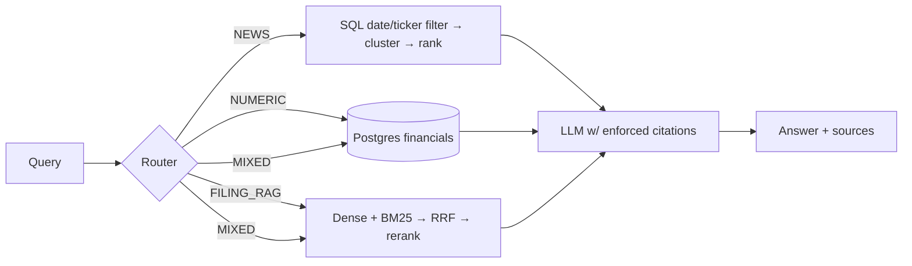

# Financial Research Copilot

Production-style RAG system over SEC filings, structured financials (XBRL → Postgres), and ticker news.
Hybrid retrieval (dense + BM25 + RRF), cross-encoder reranking, query routing, citation-enforced generation, and measured evals (dense vs hybrid vs hybrid+rerank).

**Status: scaffold.** Build order and full spec: [CLAUDE.md](CLAUDE.md). Decisions log: [DECISIONS.md](DECISIONS.md).

## Quickstart
```bash
docker compose up -d
pip install -e .
python scripts/init_db.py
python scripts/smoke_test.py     # gate for Phase 1
```

## Architecture

